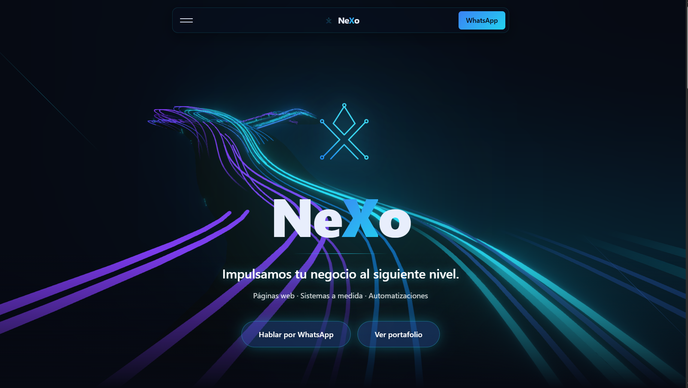

# NeXo · Landing Page

Sitio web oficial de **NeXo** — desarrollo de **páginas web, sistemas a medida y automatizaciones** para negocios.

> 🚀 *Impulsamos tu negocio al siguiente nivel.*

<p align="center">
  <a href="https://ne-xo-page.vercel.app/">
    
  </a>
</p>

🔗 **Sitio en vivo:** [ne-xo-page.vercel.app](https://ne-xo-page.vercel.app/)



---

## ✨ Características

- 🎴 **Navbar tipo Card Nav** con efecto glassmorphism
- 🌌 **Fondo Hyperspeed** (WebGL) en el Hero, con difuminado al hacer scroll
- 🧱 **Magic Bento** en Servicios (partículas + glow que sigue el cursor)
- 🃏 **Card Swap** en Portafolio (carrusel 3D con navegación manual y automática)
- 📝 **Scroll Reveal** en los títulos
- 💬 **Formulario de contacto** que abre WhatsApp con el mensaje pre-llenado
- 🔁 **Carrusel de tecnologías** en el footer
- 🪄 Smooth scroll con **Lenis**
- 📱 Diseño **responsive** (efectos pesados desactivados en móvil)

---

## 🛠️ Tech stack

| Herramienta | Uso |
|-------------|-----|
| ⚛️ **React + Vite** | Framework y bundler |
| 🎨 **Tailwind CSS v4** | Estilos |
| ✨ **GSAP** | Animaciones |
| 🌌 **Three.js + Postprocessing** | Fondo Hyperspeed (WebGL) |
| 🛟 **Lenis** | Smooth scroll |
| 🔣 **React Icons** | Iconografía |

---

## 📑 Secciones

`Hero` · `Servicios` · `Portafolio` · `Contacto` · `Footer`

---

## 🚀 Cómo ejecutarlo

```bash
# Instalar dependencias
npm install

# Modo desarrollo (http://localhost:5173)
npm run dev

# Compilar para producción
npm run build

# Previsualizar el build
npm run preview
```

---

## 📂 Estructura

```
src/
├── components/      # Navbar, Hero, Servicios, Portafolio, Contacto, Footer y efectos
├── data/
│   ├── site.js      # Datos de contacto / marca (editar aquí)
│   └── projects.js  # Proyectos del portafolio (agregar aquí)
├── App.jsx          # Arma todas las secciones
├── main.jsx
└── index.css        # Paleta de marca y estilos globales
```

> 💡 Para cambiar el teléfono, correo o agregar proyectos, edita los archivos en `src/data/`.

---

## 🎨 Marca

- **Colores:** grafito / azul noche + acento azul eléctrico → cian
- **Tipografía:** Poppins

---

Hecho con 💙 por **Brayan Cardozo** · NeXo · La Dorada, Caldas
